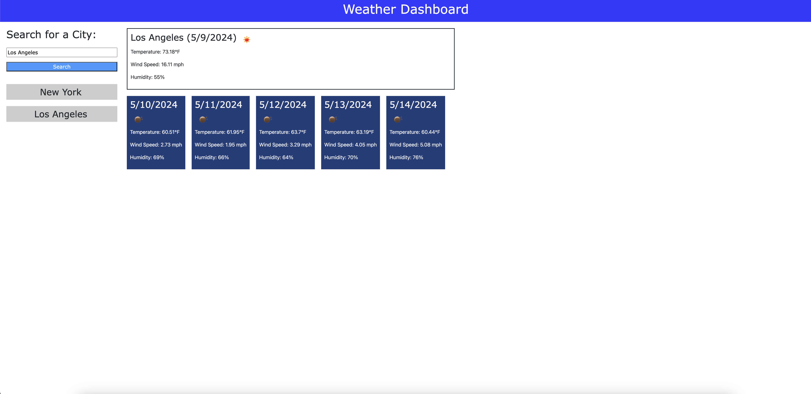

# Weather-Dashboard-Project

## Description

This is my repository for the UC Berkeley eDX Bootcamp's challenge for Week 6: Server Side APIs. I completed this challenge to demonstrate how to connect to and retrieve data from external APIs in a program utilizing JavaScript, CSS and HTML.

This repository contains the code for a one-page weather dashboard. When the user enters the name of a city into the search input, the site connects with the openweathermap.org's API to retrieve and display the city's current weather forecast on a location card. It also retrieves and display the five day forecast via separate five day forecast cards.

If a new city is searched in the input, the data in both the location and five day forecast cards are updated.

All weather data is added to the local storage.

A card is also generated with the user's search history. A new card created each time a new city is searched for.

## Installation

To install, please clone this repository to your computer using the following steps:

1. Click the "Code" dropdown menu and copy the SSH URL.
2. Open your terminal and navigate to the directory you would like to clone this repository into.
3. Type "git clone <paste SSH URL>", replacing <paste SSH URL> with your copied SSH URL.
4. Press enter.

## Usage

To view this site, either visit the link <https://jacobmca.github.io/Weather-Dashboard-Project/> or open the Weather-Dashboard-Project/index.html file on any major browser from your computer.

## Screenshots

## Credits

Created by Jacob McAuliffe for the UC Berkeley eDX Coding Boot Camp.

## License

MIT License

Copyright (c) 2024 Jacob McAuliffe

Permission is hereby granted, free of charge, to any person obtaining a copy
of this software and associated documentation files (the "Software"), to deal
in the Software without restriction, including without limitation the rights
to use, copy, modify, merge, publish, distribute, sublicense, and/or sell
copies of the Software, and to permit persons to whom the Software is
furnished to do so, subject to the following conditions:

The above copyright notice and this permission notice shall be included in all
copies or substantial portions of the Software.

THE SOFTWARE IS PROVIDED "AS IS", WITHOUT WARRANTY OF ANY KIND, EXPRESS OR
IMPLIED, INCLUDING BUT NOT LIMITED TO THE WARRANTIES OF MERCHANTABILITY,
FITNESS FOR A PARTICULAR PURPOSE AND NONINFRINGEMENT. IN NO EVENT SHALL THE
AUTHORS OR COPYRIGHT HOLDERS BE LIABLE FOR ANY CLAIM, DAMAGES OR OTHER
LIABILITY, WHETHER IN AN ACTION OF CONTRACT, TORT OR OTHERWISE, ARISING FROM,
OUT OF OR IN CONNECTION WITH THE SOFTWARE OR THE USE OR OTHER DEALINGS IN THE
SOFTWARE.

